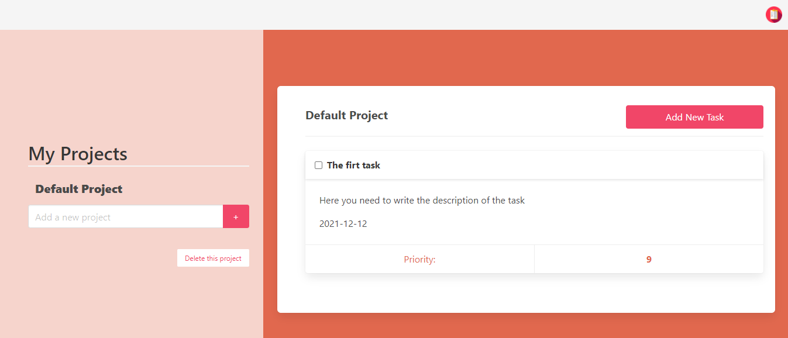

# Todo-List

This project consists in build a Todo-List. Using the concepts of Single Responsibility and Tightly Coupled Objects. In this project, you can create a new Project and inside this project, you can create a task, the task contains a title, description, due date, and priority.

## Live demo

[live demo]()

## Built With

- JavaScript
- HTML
- CSS
- Webpack
- Package.json

## How to start the project from your Local enviroment

- Open your terminal and cd where you want to store the project
- Run the following command - `git clone https://github.com/mricanho/To-do-list.git`
- Cd into the directory - `cd To-do-list$`
- Open the live server on your VScode `Alt + L` then `Alt + o` on `idex.html`

## Author

👤 **Brian Cruz**

- Github: [@githubhandle](https://github.com/BrianSammit)
- Twitter: [@twitterhandle](https://twitter.com/cruzsammit)
- Linkedin: [linkedin](https://www.linkedin.com/in/brian-sammit-cruz-rodriguez-5877551a8/)

👤 **Miguel Ricaño**

- Github: [@mricanho](https://github.com/mricanho)
- Linkedin: [Miguel Ricaño](https://www.linkedin.com/in/mricanho/)

## 🤝 Contributing

Contributions, issues and feature requests are welcome!

## Show your support

Give a star if you :star: like this project!

## Acknowledgments

- Microverse
- GitHub
- TheOdinProject
- JavaScript
